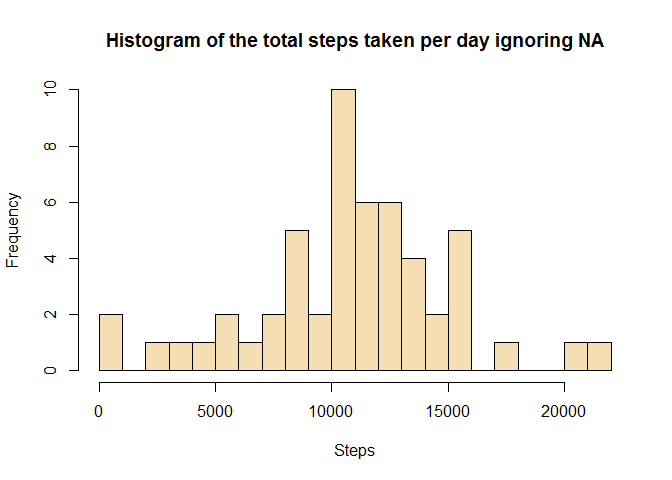
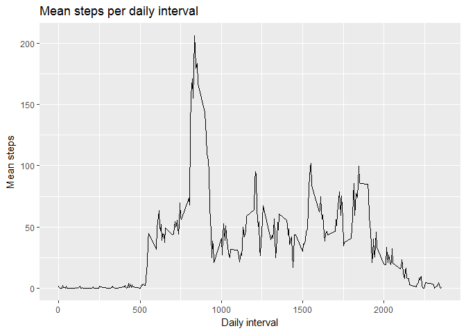
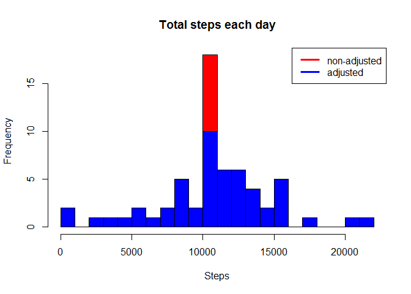
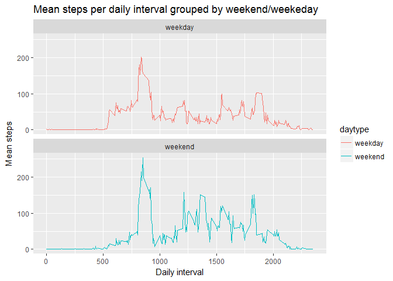

# Reproducible Research: Peer Assessment 1
Mark Salib  
8 April 2017  


###Loading and preprocessing the data

```r
dat <- read.csv("activity.csv")

dat$date <- as.Date(dat$date)

dat <- dat %>% 
        mutate( day = as.numeric(day(dat$date))) %>%
        mutate(steps = as.numeric(steps))
```

##What is mean total number of steps taken per day?
  
1- Calculate the total number of steps taken per day
  

```r
dat %>% 
        group_by(date) %>%
        summarise(totSteps = sum(steps))
```

```
## # A tibble: 61 × 2
##          date totSteps
##        <date>    <dbl>
## 1  2012-10-01       NA
## 2  2012-10-02      126
## 3  2012-10-03    11352
## 4  2012-10-04    12116
## 5  2012-10-05    13294
## 6  2012-10-06    15420
## 7  2012-10-07    11015
## 8  2012-10-08       NA
## 9  2012-10-09    12811
## 10 2012-10-10     9900
## # ... with 51 more rows
```
  
  
2- Make a histogram
  

```r
histdat<- dat %>% 
          group_by(date) %>%
          summarise(totSteps = sum(steps)) 

hist(histdat$totSteps, main = "Histogram of the total steps taken per day ignoring NA", xlab = "Steps", breaks = 16, col = "wheat")
```

<!-- -->
  
  
3- calculate mean and median
  

```r
dat %>% 
        group_by(date) %>%
        summarise(meanSteps = mean(steps), medianSteps = median(steps)) 
```

```
## # A tibble: 61 × 3
##          date meanSteps medianSteps
##        <date>     <dbl>       <dbl>
## 1  2012-10-01        NA          NA
## 2  2012-10-02   0.43750           0
## 3  2012-10-03  39.41667           0
## 4  2012-10-04  42.06944           0
## 5  2012-10-05  46.15972           0
## 6  2012-10-06  53.54167           0
## 7  2012-10-07  38.24653           0
## 8  2012-10-08        NA          NA
## 9  2012-10-09  44.48264           0
## 10 2012-10-10  34.37500           0
## # ... with 51 more rows
```


## What is the average daily acitivity pattern?


```r
plotdat <- dat %>% 
                group_by(interval) %>%
                summarise(meanSteps = mean(steps, na.rm = TRUE)) 
        
ggplot(plotdat, aes(interval, meanSteps)) + geom_line() +
        ggtitle("Mean steps per daily interval") +
        xlab("Daily interval") + 
        ylab("Mean steps")
```

<!-- -->
  

2- Find busiest interval  
  

```r
dat %>% 
        group_by(interval) %>%
        summarise(meanSteps = mean(steps, na.rm = TRUE)) %>%
        filter(meanSteps == max(meanSteps))
```

```
## # A tibble: 1 × 2
##   interval meanSteps
##      <int>     <dbl>
## 1      835  206.1698
```

##Imputing missing values
  
 1- Count how many missing values 
  

```r
dat %>% summarise(naCount = sum(is.na(steps)))
```

```
##   naCount
## 1    2304
```

2- Devise strategy for filling in the missing values

na values will be replaced by average for that 5 minute interval
 

```r
datna.rm <- dat %>%
        group_by(interval) %>%
        summarise(meanSteps = mean(steps, na.rm =TRUE))


datNew <- dat %>% mutate(newSteps = ifelse(is.na(steps) , datna.rm$meanSteps[match(interval, datna.rm$interval)] , steps))


histdat<- datNew %>% 
          group_by(date) %>%
          summarise(totSteps = sum(newSteps, na.rm = TRUE)) 
```

Calculate the total, mean and median of the adjusted data
 

```r
datNew %>% 
        group_by(date) %>%
        summarise(totSteps = sum(newSteps), meanSteps = mean(newSteps), medianSteps = median(newSteps) ) 
```

```
## # A tibble: 61 × 4
##          date totSteps meanSteps medianSteps
##        <date>    <dbl>     <dbl>       <dbl>
## 1  2012-10-01 10766.19  37.38260    34.11321
## 2  2012-10-02   126.00   0.43750     0.00000
## 3  2012-10-03 11352.00  39.41667     0.00000
## 4  2012-10-04 12116.00  42.06944     0.00000
## 5  2012-10-05 13294.00  46.15972     0.00000
## 6  2012-10-06 15420.00  53.54167     0.00000
## 7  2012-10-07 11015.00  38.24653     0.00000
## 8  2012-10-08 10766.19  37.38260    34.11321
## 9  2012-10-09 12811.00  44.48264     0.00000
## 10 2012-10-10  9900.00  34.37500     0.00000
## # ... with 51 more rows
```

Compare histograms


```r
histdat_before<- dat %>% 
          group_by(date) %>%
          summarise(totSteps = sum(steps)) 


histdat_after<- datNew %>% 
          group_by(date) %>%
          summarise(totSteps = sum(newSteps)) 


hist(histdat_after$totSteps, main = "Total steps each day", xlab = "Steps", breaks = 16, col = "red" )
hist(histdat_before$totSteps, main = "Total steps each day", xlab = "Steps", breaks = 16, col = "blue", add = TRUE)
legend("topright", c("non-adjusted", "adjusted"), col=c("red", "blue"), lwd=3)
```

<!-- -->


Whats the final effect of adjusting the NAs?

- More total steps but with same mean which is consistant with the method I used to replace NAs


```r
dat %>% summarise(totSteps = sum(steps, na.rm = TRUE), meanSteps = mean(steps, na.rm = TRUE) , medianSteps = median(steps, na.rm = TRUE))
```

```
##   totSteps meanSteps medianSteps
## 1   570608   37.3826           0
```

```r
datNew %>%  summarise(totNEWSteps = sum(newSteps), meanNEWSteps = mean(newSteps) , medianNEWSteps = median(newSteps))
```

```
##   totNEWSteps meanNEWSteps medianNEWSteps
## 1    656737.5      37.3826              0
```


## Are there differences in activity patterns between weekdays and weekends?


```r
library(lubridate)

datNew <- datNew %>% mutate(daytype =ifelse(wday(date) %in% c(6,7) , "weekend" , "weekday" ))

plotdat <- datNew %>% 
                group_by(interval, daytype) %>%
                summarise(meanSteps = mean(newSteps)) 
        
ggplot(plotdat, aes(interval, meanSteps, colour = daytype)) + geom_line() +
        ggtitle("Mean steps per daily interval grouped by weekend/weekeday") +
        xlab("Daily interval") + 
        ylab("Mean steps") +
        facet_wrap(~daytype, ncol = 1, nrow = 2)
```

<!-- -->
